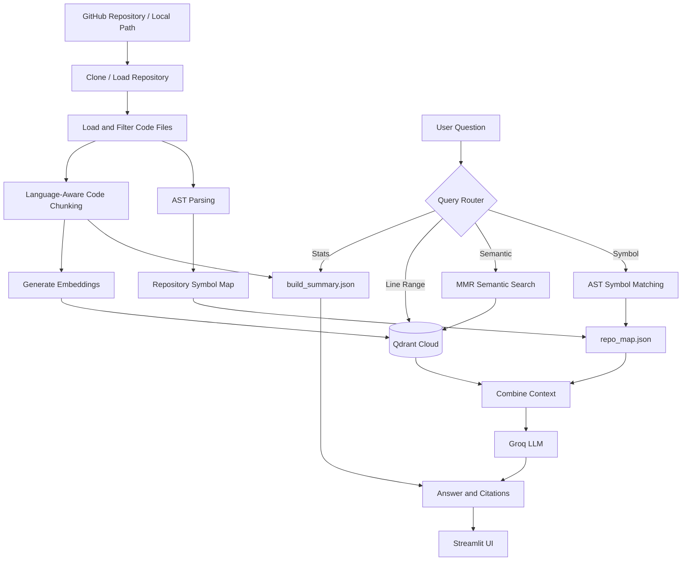

# ⚡ Codebase Knowledge AI

> A production-deployed RAG (Retrieval-Augmented Generation) system that lets you chat with any GitHub repository — ask architecture questions, find functions, trace logic across files — and get answers with exact file + line-number citations.

🔗 **[Live Demo](https://codebase-knowledge-ai-xbfw3jsdezl34cgrdden2p.streamlit.app/)** **

---

## 🎯 Overview

Onboarding into a large, unfamiliar codebase is slow and frustrating. Traditional keyword search (grep/Ctrl+F) finds text, not meaning or relationships. **Codebase Knowledge AI** solves this by combining:

- **Semantic vector search** (understands *meaning*, not just keywords)
- **AST-based structural analysis** (understands *exact* code structure — functions, classes, imports)
- **LLM reasoning** (synthesizes both into a grounded, cited natural-language answer)

The result: ask *"Where is the payment logic?"* or *"How does auth flow work across these files?"* and get a precise, source-cited answer in seconds — not hours of manual searching.

---

## ✨ Key Features

- 🔍 **Hybrid Retrieval** — combines MMR-based semantic search with deterministic AST symbol lookup
- 📎 **File + Line-Level Citations** — every answer traces back to exact `file.py:start-end`
- 🧠 **AST Repo Map** — extracts every function, class, method, and import with line numbers using Python's `ast` module
- 🧩 **Language-Aware Chunking** — splits code at logical boundaries (functions/classes), not arbitrary character counts
- 📊 **Instant Stats Answers** — file/chunk counts answered directly without an LLM call
- 🎯 **Line-Range Search** — direct retrieval for queries like `engine.py 10-40`
- ☁️ **Cloud-Native** — stateless app, vectors persisted in managed cloud vector DB
- 🚫 **Hallucination-Resistant** — AST layer only surfaces symbols that actually exist in the code
- 🌐 **Multi-Repo Support** — index and query multiple repositories independently

---

## 🛠️ Tech Stack

| Layer | Technology | Purpose |
|---|---|---|
| **Frontend / UI** | Streamlit | Interactive web app — indexing, Q&A, KPI dashboard |
| **Orchestration Framework** | LangChain | Document loading, chunking, retrieval pipeline glue |
| **LLM Inference** | Groq API (`gpt-oss-20b`) | Fast, free-tier cloud LLM for answer generation |
| **Vector Database** | Qdrant Cloud | Managed, persistent vector storage with MMR search |
| **Embeddings** | HuggingFace `all-MiniLM-L6-v2` | Converts code chunks into 384-dim semantic vectors |
| **AST Parsing** | Python `ast` module | Extracts exact function/class/import structure |
| **Code Loading & Parsing** | tree-sitter (via LangChain `LanguageParser`) | Multi-language-aware document loading |
| **Repo Management** | GitPython | Clone/pull GitHub repositories |
| **Deployment** | Streamlit Community Cloud | Free, public hosting |
| **Language** | Python 3.11 | Core implementation |

## 🏗️ Architecture & Workflow

The system works in two main phases: **Repository Indexing** and **Question Answering**.



### 🔹 Phase 1 — Repository Indexing

The indexing phase prepares the repository for intelligent code search and question answering.

- **Clone & Load Repository** — GitPython clones the GitHub repository or loads a local project.
- **Load & Filter Files** — Relevant source-code files are identified and processed.
- **Code Chunking** — Source code is divided into meaningful, language-aware chunks.
- **AST Parsing** — Python's `ast` module extracts functions, classes, methods, imports, and their exact line numbers.
- **Generate Embeddings** — HuggingFace `all-MiniLM-L6-v2` converts code chunks into 384-dimensional semantic vectors.
- **Store Vectors** — Embeddings and metadata are stored in a dedicated Qdrant Cloud collection.
- **Build Repository Map** — `repo_map.json` stores symbols and their locations for precise code navigation.
- **Build Summary** — `build_summary.json` stores repository and indexing statistics.

### 🔹 Phase 2 — Question Answering

The querying phase processes user questions and retrieves the most relevant repository information.

- **User Question** — The user submits a question through the Streamlit interface.
- **Query Router** — Classifies the question based on the required information.
- **Stats Query** — Retrieves repository statistics directly from `build_summary.json` without using the LLM.
- **Line-Range Query** — Retrieves the requested code directly from Qdrant.
- **Semantic Query** — Uses MMR search to retrieve diverse and relevant code chunks.
- **AST Symbol Matching** — Identifies exact functions, classes, methods, or imports from `repo_map.json`.
- **Context Combination** — Combines semantic search results with AST information.
- **LLM Generation** — Groq LLM generates a grounded answer using the retrieved repository context.
- **Final Response** — Streamlit displays the answer along with citations, AST hints, and retrieved context.

## 🔄 How It Works / Retrieval Pipeline

Every user question passes through a **3-way query router** before reaching the LLM. This keeps simple queries fast and avoids unnecessary LLM calls.

### Query Flow

```text
User Question
      │
      ▼
┌─────────────────────────────┐
│     1. Stats Query Check    │
│  "How many files?"          │
└─────────────┬───────────────┘
              │
          Yes │
              ▼
     build_summary.json
              │
              ▼
       Instant Response
         (No LLM)
              │
          No  │
              ▼
┌─────────────────────────────┐
│   2. Line-Range Check       │
│   "engine.py 10 40"         │
└─────────────┬───────────────┘
              │
          Yes │
              ▼
       Qdrant Retrieval
              │
              ▼
        Raw Code Output
         (No LLM)
              │
          No  │
              ▼
┌─────────────────────────────┐
│  3. Hybrid Retrieval        │
│                             │
│  • MMR Semantic Search      │
│  • AST Symbol Matching      │
└─────────────┬───────────────┘
              │
              ▼
     Combine Retrieved
          Context
              │
              ▼
       Groq LLM
     (gpt-oss-20b)
              │
              ▼
 Answer + Citations + AST Hints
              │
              ▼
        Streamlit UI
```

### 🔹 1. Stats Query

Questions about repository statistics are answered directly from `build_summary.json`.

**Examples:**
- "How many files are indexed?"
- "How many chunks were created?"
- "List indexed files."

These queries do **not require an LLM call**, making them faster and cheaper.

### 🔹 2. Line-Range Query

For queries containing a file and line range, the system directly retrieves the requested code from Qdrant.

**Example:**

```text
engine.py 10 40
```

The system returns the corresponding source code without sending the request to the LLM.

### 🔹 3. Hybrid Semantic Retrieval

For conceptual or code-understanding questions, the system performs two complementary retrieval operations:

**MMR Semantic Search**
- Searches code embeddings stored in Qdrant.
- Retrieves diverse and semantically relevant code chunks.
- Reduces near-duplicate results.

**AST Symbol Matching**
- Searches the repository's AST symbol map.
- Identifies exact functions, classes, methods, and imports.
- Provides precise structural information and line numbers.

The retrieved semantic chunks and AST information are then combined into a structured context for the LLM.

### 🔹 4. Grounded Answer Generation

The combined context is passed to the **Groq `gpt-oss-20b`** model.

The generated response includes:

- 📄 File references
- 📍 Exact line ranges
- 🔗 Source citations
- 🧠 AST-based symbol hints
- 📦 Retrieved code context

### Why This Design?

- **⚡ Speed & Cost** — Stats and line-range queries bypass the LLM completely.
- **🎯 Accuracy** — MMR provides diverse semantic results while AST matching provides deterministic structural information.
- **🔎 Transparency** — Retrieved file and line metadata allows answers to be traced back to the source code.

## 💬 Example Queries

| Question | Retrieval Path | Sample Output |
|---|---|---|
| `How many files are indexed?` | Stats — No LLM | `"8 files indexed into 196 chunks..."` |
| `List indexed files` | Stats — No LLM | List of indexed file paths |
| `engine.py 1 40` | Line Range — No LLM | Raw code from `engine.py`, lines 1–40 |
| `Where is the Value class defined?` | Hybrid + LLM | `Value` class location with file and line citations |
| `What does backward() do?` | Hybrid + LLM | Explanation of topological sort and reverse chain rule |
| `Which symbols relate to relu?` | Hybrid + LLM | Matching `relu` function and `Value.relu` method |
| `How does auth flow work across these files?` | Hybrid + LLM | Cross-file explanation with multiple citations |

## ⚙️ Installation & Setup

### 1. Clone the Repository

```bash
git clone https://github.com/YOUR_USERNAME/codebase-knowledge-ai.git
cd codebase-knowledge-ai
```

### 2. Create a Virtual Environment

```bash
python -m venv .venv
```

**Windows:**

```bash
.venv\Scripts\activate
```

**macOS / Linux:**

```bash
source .venv/bin/activate
```

### 3. Install Dependencies

```bash
pip install -r requirements.txt
```

### 4. Configure Environment Variables

```bash
cp .env.example .env
```

Then add your API credentials to `.env`.

### 5. Run the Application

```bash
streamlit run app.py
```

The application will open at:

`http://localhost:8501`

Use the **Index Repository** tab to index a GitHub repository or local project, then switch to **Ask Questions** to query the codebase.

## 🔐 Environment Variables

Create a `.env` file in the project root using `.env.example` as the template.

| Variable | Description | Example |
|---|---|---|
| `GROQ_API_KEY` | API key for Groq inference | `gsk_...` |
| `GROQ_MODEL` | Groq model used for answer generation | `openai/gpt-oss-20b` |
| `QDRANT_URL` | Qdrant Cloud cluster endpoint | `https://xxxx.aws.cloud.qdrant.io` |
| `QDRANT_API_KEY` | Qdrant Cloud API key | `eyJhbGci...` |
| `EMBED_MODEL` | HuggingFace embedding model | `sentence-transformers/all-MiniLM-L6-v2` |
| `TOP_K` | Number of chunks retrieved per query | `5` |
| `CHUNK_SIZE` | Maximum characters per code chunk | `900` |
| `CHUNK_OVERLAP` | Overlap between consecutive chunks | `140` |

> ⚠️ **Never commit `.env` to GitHub.** Keep it in `.gitignore` and commit only `.env.example` with placeholder values.

## 📁 Project Structure

```text
codebase-knowledge-ai/
│
├── app.py                    # Streamlit UI, indexing, Q&A and dashboard
├── indexer.py                # Repository cloning, chunking and indexing
├── retriever.py              # Query routing, retrieval and LLM generation
├── ast_parser.py             # AST-based symbol extraction
│
├── data/
│   └── repos/                # Local repository working copies
│
├── .streamlit/
│   └── config.toml           # Streamlit configuration
│
├── requirements.txt          # Python dependencies
├── .env.example              # Environment variable template
├── .gitignore
└── README.md


If `repo_map.json` and `build_summary.json` are **actually generated inside your `data/` directory**, then show them there. Don't document files/directories that aren't actually in the repository.

---

# 6. 🌟 Key Technical Highlights

This is one of the strongest sections of your README. I'd make it slightly more concise:

```markdown
## 🌟 Key Technical Highlights

- **Hybrid Retrieval Architecture** — Combines MMR-based semantic search with deterministic AST symbol lookup for both semantic understanding and precise code structure.

- **Language-Aware Chunking** — Uses `RecursiveCharacterTextSplitter.from_language()` to split source code according to language-specific syntax.

- **Zero-LLM Fast Paths** — Stats and line-range queries are answered directly from structured metadata or vector-store retrieval without requiring an LLM call.

- **Exact Line-Level Provenance** — Each code chunk stores `start_line` and `end_line` metadata, enabling precise `file:start-end` citations.

- **Cloud-Native Deployment** — Uses Groq for LLM inference and Qdrant Cloud for persistent vector storage, allowing the deployed application to remain stateless.

- **Per-Repository Isolation** — Each indexed repository uses a dedicated Qdrant collection to prevent cross-repository retrieval contamination.

- **Metadata Sanitization** — Normalizes metadata values before vector-store upload to ensure compatibility with Qdrant payload requirements.

- **Cloud Migration** — Migrated from a local Ollama + FAISS architecture to a distributed Groq + Qdrant stack, reducing typical query latency from approximately 30–60 seconds to under 5 seconds.

## ⚠️ Limitations & Future Improvements

| Current Limitation | Planned Improvement |
|---|---|
| AST symbol matching is keyword-based, so loosely related terms may occasionally appear as hints | Embed symbol names and use vector similarity for AST hint matching |
| No incremental re-indexing — a full re-index is required after code changes | Add webhook-triggered incremental indexing using Git diffs |
| Indexing large monorepos can be slow and memory-intensive | Use two-stage retrieval: index signatures first and fetch full bodies on demand |
| JSON metadata is stored on local/ephemeral disk in the deployed environment | Move metadata into Qdrant payloads or a lightweight hosted database such as PostgreSQL |
| Multi-repository querying is not supported simultaneously | Add federated search across multiple repository collections |
| Public demo has no authentication or rate limiting | Add API authentication and rate limiting |
| Interface is currently UI-only | Expose REST endpoints such as `/index` and `/query` through FastAPI for IDE and CI integration |


