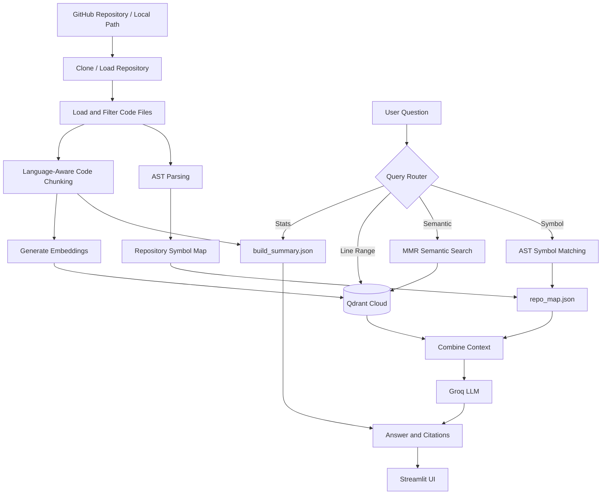

# ⚡ Codebase Knowledge AI

> A production-deployed RAG (Retrieval-Augmented Generation) system that lets you chat with any GitHub repository — ask architecture questions, find functions, trace logic across files — and get answers with exact file + line-number citations.

🔗 **[Live Demo](https://codebase-knowledge-ai-xbfw3jsdezl34cgrdden2p.streamlit.app/)** **

---

## 🎯 Overview

Onboarding into a large, unfamiliar codebase is slow and frustrating. Traditional keyword search (grep/Ctrl+F) finds text, not meaning or relationships. **Codebase Knowledge AI** solves this by combining:

- **Semantic vector search** (understands *meaning*, not just keywords)
- **AST-based structural analysis** (understands *exact* code structure — functions, classes, imports)
- **LLM reasoning** (synthesizes both into a grounded, cited natural-language answer)

The result: ask *"Where is the payment logic?"* or *"How does auth flow work across these files?"* and get a precise, source-cited answer in seconds — not hours of manual searching.

---

## ✨ Key Features

- 🔍 **Hybrid Retrieval** — combines MMR-based semantic search with deterministic AST symbol lookup
- 📎 **File + Line-Level Citations** — every answer traces back to exact `file.py:start-end`
- 🧠 **AST Repo Map** — extracts every function, class, method, and import with line numbers using Python's `ast` module
- 🧩 **Language-Aware Chunking** — splits code at logical boundaries (functions/classes), not arbitrary character counts
- 📊 **Instant Stats Answers** — file/chunk counts answered directly without an LLM call
- 🎯 **Line-Range Search** — direct retrieval for queries like `engine.py 10-40`
- ☁️ **Cloud-Native** — stateless app, vectors persisted in managed cloud vector DB
- 🚫 **Hallucination-Resistant** — AST layer only surfaces symbols that actually exist in the code
- 🌐 **Multi-Repo Support** — index and query multiple repositories independently

---

## 🛠️ Tech Stack

| Layer | Technology | Purpose |
|---|---|---|
| **Frontend / UI** | Streamlit | Interactive web app — indexing, Q&A, KPI dashboard |
| **Orchestration Framework** | LangChain | Document loading, chunking, retrieval pipeline glue |
| **LLM Inference** | Groq API (`gpt-oss-20b`) | Fast, free-tier cloud LLM for answer generation |
| **Vector Database** | Qdrant Cloud | Managed, persistent vector storage with MMR search |
| **Embeddings** | HuggingFace `all-MiniLM-L6-v2` | Converts code chunks into 384-dim semantic vectors |
| **AST Parsing** | Python `ast` module | Extracts exact function/class/import structure |
| **Code Loading & Parsing** | tree-sitter (via LangChain `LanguageParser`) | Multi-language-aware document loading |
| **Repo Management** | GitPython | Clone/pull GitHub repositories |
| **Deployment** | Streamlit Community Cloud | Free, public hosting |
| **Language** | Python 3.11 | Core implementation |

## 🏗️ Architecture & Workflow

The system works in two main phases: **Repository Indexing** and **Question Answering**.

### 🔹 Phase 1 — Repository Indexing

The indexing phase prepares the repository for intelligent code search and question answering.

- **Clone & Load Repository** — GitPython clones the GitHub repository or loads a local project.
- **Load & Filter Files** — Relevant source-code files are identified and processed.
- **Code Chunking** — Source code is divided into meaningful, language-aware chunks.
- **AST Parsing** — Python's `ast` module extracts functions, classes, methods, imports, and their exact line numbers.
- **Generate Embeddings** — HuggingFace `all-MiniLM-L6-v2` converts code chunks into 384-dimensional semantic vectors.
- **Store Vectors** — Embeddings and metadata are stored in a dedicated Qdrant Cloud collection.
- **Build Repository Map** — `repo_map.json` stores symbols and their locations for precise code navigation.
- **Build Summary** — `build_summary.json` stores repository and indexing statistics.

### 🔹 Phase 2 — Question Answering

The querying phase processes user questions and retrieves the most relevant repository information.

- **User Question** — The user submits a question through the Streamlit interface.
- **Query Router** — Classifies the question based on the required information.
- **Stats Query** — Retrieves repository statistics directly from `build_summary.json` without using the LLM.
- **Line-Range Query** — Retrieves the requested code directly from Qdrant.
- **Semantic Query** — Uses MMR search to retrieve diverse and relevant code chunks.
- **AST Symbol Matching** — Identifies exact functions, classes, methods, or imports from `repo_map.json`.
- **Context Combination** — Combines semantic search results with AST information.
- **LLM Generation** — Groq LLM generates a grounded answer using the retrieved repository context.
- **Final Response** — Streamlit displays the answer along with citations, AST hints, and retrieved context.
